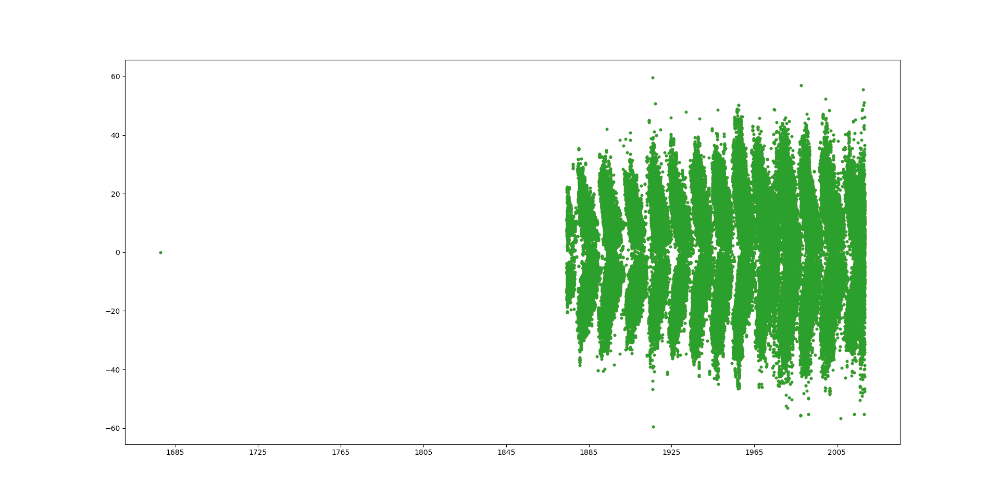
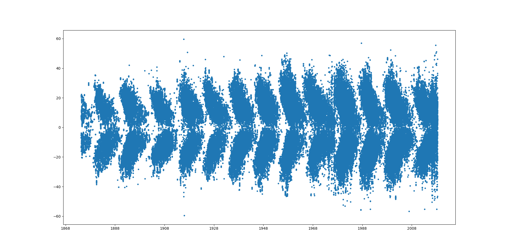
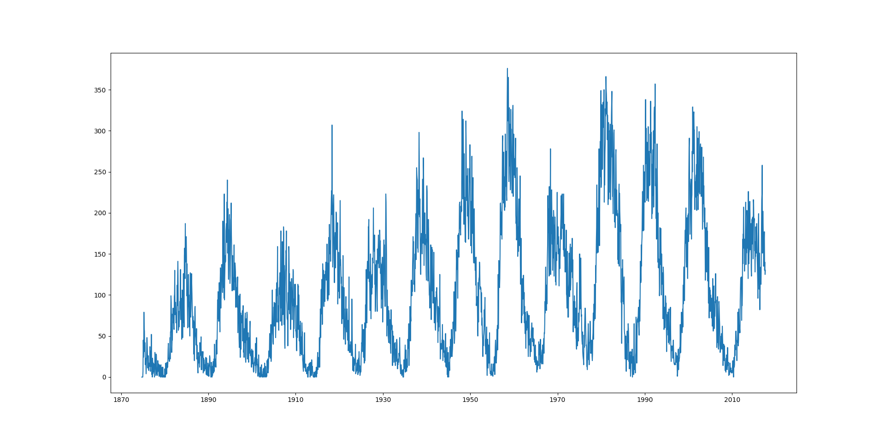
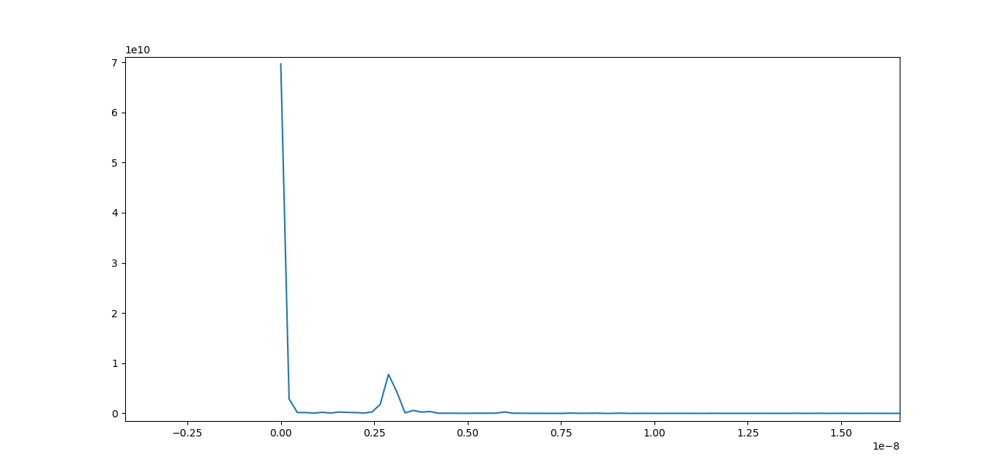
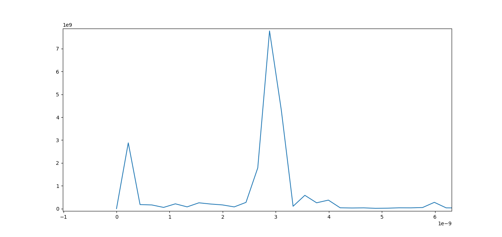

Sunspots are dark regions which appear on the surface of the Sun and last for a few days to a few months and frequently appear in groups. The number of sunspots varies with the approximately 11-year solar magnetic activity cycle. To learn Pandas I chose to explore Sunspot data with the specific goal of trying to determine the period of the solar cycle.

## Choosing Data

To measure the solar cycle we will need counts of sunspots or relatedly counts of sunspot groups as a function of time. I found a good source for Sunspot data here: [http://fenyi.solarobs.csfk.mta.hu/DPD/](http://fenyi.solarobs.csfk.mta.hu/DPD/). The different types of data are described here: [http://fenyi.solarobs.csfk.mta.hu/ftp/pub/DPD/DPDformat.txt](http://fenyi.solarobs.csfk.mta.hu/ftp/pub/DPD/DPDformat.txt). There are three types of data "day", "group", and "spot". The "day" data contains sums of area covered by sunspots but not counts. So that leaves either the "spot" data or the "group" data. I have choosen to use the "group" data for two main reasons:

* An older portion of the data set (1874-1976) doesn't contain "spot" data so using "group" data allows a longer baseline.
* Using group data reduces the size of the data files considerably

## Downloading Data
Now that we have decided on the data to use the next step is to download it. We could just click on each link and save the file, however there is a file for each year from 1874 to 2018, so that is 145 files. That might take a while, lets get the computer to do for us. 

I am betting that someone has probably already wanted to download something over HTTP already using Python. So I search "python http download" in google. The first hit is a stack overflow page: [https://stackoverflow.com/questions/22676/how-do-i-download-a-file-over-http-using-python](https://stackoverflow.com/questions/22676/how-do-i-download-a-file-over-http-using-python). The first answer mentions "urllib2". Some searching for urllib2 information, revealed that in Python3 (which is what we are using) they dropped the "2" so it is just urllib, and here is the documentation: [https://docs.python.org/3/library/urllib.html](https://docs.python.org/3/library/urllib.html). 

Often when I want to do something new with Python (or any language) I go through some similar process to figure out if there is something out there already that can easily do what I want. There is usually a trade off between learning a new tool (module, function, library etc.) and creating the tool your self. If the task is relatively simple finding and learning a new tool can sometimes be more work than writing your own tool from scratch. However, if the task is more complex it can often be faster to use something that has already been created for the task.

In this case urllib is fairly simple to figure out and writing code from scratch to download content over HTTP could be a fair amount of work. Looking at the [urllib](https://docs.python.org/3/library/urllib.html) docs I see "urllib.request for opening and reading URLs" sounds like maybe what I want. Lets take a look.

>urllib.request.urlopen(url, data=None, [timeout, ]*, cafile=None, capath=None, cadefault=False, context=None)
>
>Open the URL url, which can be either a string or a Request object.

Usually with Python when you "open" something you get that object back, for example when working with files you get a file object back which lets you do operations on the file, like reading and writing. In the case of <code>urllib.request.urlopen</code> what do we get back? Reading a little further I see

>For HTTP and HTTPS URLs, this function returns a http.client.HTTPResponse object slightly modified. In addition to the three new methods above, the msg attribute contains the same information as the reason attribute — the reason phrase returned by server — instead of the response headers as it is specified in the documentation for HTTPResponse.

The first part of that tells us that <code>urlopen</code> returns an [HTTPResponse](https://docs.python.org/3/library/http.client.html#http.client.HTTPResponse) object when you use an HTTP or HTTPS url. Scrolling down in the docs we find:

>HTTPResponse.read([amt])
>
>Reads and returns the response body, or up to the next amt bytes.

Ah ha! That's what we want, it returns the body of the response, or in other words the body of the webpage. In our case the webpage is a plain text file with data in it. Now we can take what we get from the <code>read</code> function and write it to a file. Ok lets try writing some Python code to try this out.

Start by opening up your the Spyder IDE. 

I want to create a folder to work in, so in the "Console" tab type:

~~~
In[1]: pwd
~~~
{: .bash}
~~~
Out[1]: 'C:\\Users\\chris'
~~~
{: .output}
~~~
In[2]: cd Desktop
~~~
{: .bash}
~~~
C:\Users\chris\Desktop
~~~
{: .output}
~~~
In[3]: mkdir sunspots
In[4]: cd sunspots
~~~
{: .bash}
~~~
C:\Users\chris\Desktop\sunspots
~~~
{: .output}
Since we know we will be downloading a bunch of data files, lets make a separate directory to save them in to keep our directory from getting cluttered up with them.
~~~
In[]: mkdir data
~~~
{: .bash}

Next save the <code>temp.py</code> file to a file under this newly created directory called <code>get_data.py</code>. 

Lets put in some very simple python code to start by checking that everything works properly.

~~~
def main():
  print("hello world")
  
if __name__ == "__main__":
  main()
~~~
{: .language-python}

To run this code in the console type:
~~~
In[5]: run get_data.py
~~~
{: .bash}
~~~
hello world
~~~
{: .output}

Looks good! Now lets try out the urllib functions, first we must import the module by adding
~~~
import urllib
~~~
{: .language-python}

Now lets copy the URL of a test data file
* [http://fenyi.solarobs.csfk.mta.hu/ftp/pub/DPD/data/gDPD1974.txt](http://fenyi.solarobs.csfk.mta.hu/ftp/pub/DPD/data/gDPD1974.txt)

Noticing that the year is appended to the end of the URL. If we look at successive years we see that they all have the same URL except that the year part of it is incremented. So we can access the data for the different years with URLS like:

* [http://fenyi.solarobs.csfk.mta.hu/ftp/pub/DPD/data/gDPD1974.txt](http://fenyi.solarobs.csfk.mta.hu/ftp/pub/DPD/data/gDPD1974.txt)
* [http://fenyi.solarobs.csfk.mta.hu/ftp/pub/DPD/data/gDPD1975.txt](http://fenyi.solarobs.csfk.mta.hu/ftp/pub/DPD/data/gDPD1975.txt)
* ...
* [http://fenyi.solarobs.csfk.mta.hu/ftp/pub/DPD/data/gDPD2018.txt](http://fenyi.solarobs.csfk.mta.hu/ftp/pub/DPD/data/gDPD2018.txt)

So we could loop over the years 1974 to 2018. Further if we look at the pre-1974 data we see a similar pattern, though with a slightly different URL.

* [http://fenyi.solarobs.csfk.mta.hu/ftp/pub/GPR/data/gGPR1872.txt](http://fenyi.solarobs.csfk.mta.hu/ftp/pub/GPR/data/gGPR1872.txt)
* [http://fenyi.solarobs.csfk.mta.hu/ftp/pub/GPR/data/gGPR1873.txt](http://fenyi.solarobs.csfk.mta.hu/ftp/pub/GPR/data/gGPR1873.txt)
* [http://fenyi.solarobs.csfk.mta.hu/ftp/pub/GPR/data/gGPR1874.txt](http://fenyi.solarobs.csfk.mta.hu/ftp/pub/GPR/data/gGPR1874.txt)
* ...
* [http://fenyi.solarobs.csfk.mta.hu/ftp/pub/GPR/data/gGPR1976.txt](http://fenyi.solarobs.csfk.mta.hu/ftp/pub/GPR/data/gGPR1976.txt)

You will notice that they overlap by a couple years, in the case of duplicates I am going to choose from the "newer". Also if you looked at the first two data files in the 1872-1976 data set you will notice they are actually empty, so we will start at 1874. So we have two base URLS
* <code>http://fenyi.solarobs.csfk.mta.hu/ftp/pub/DPD/data/gDPD</code> over the range of years [1974, 2018]
* <code>http://fenyi.solarobs.csfk.mta.hu/ftp/pub/GPR/data/gGPR</code> over the range of years [1874, 1973]

from which we can append a year and a <code>.txt</code> to generate a complete URL we can use to download the data files.  Lets put some of this into code:

~~~
import urllib

def main():
  
  baseURLNew="http://fenyi.solarobs.csfk.mta.hu/ftp/pub/DPD/data/gDPD"
  newYears=range(1974,2019,1)
  baseURLOld="http://fenyi.solarobs.csfk.mta.hu/ftp/pub/GPR/data/gGPR"
  oldYears=range(1874,1974,1)
  
  for year in newYears:
    print(year)
  
if __name__ == "__main__":
  main()
~~~
{: .language-python}
~~~
1974
1975
.
.
.
2018
~~~
{: .output}

Lets actually use urllib now and read in part of one of the data files and write it out to the console to check that we are getting what we wanted.
~~~
import urllib

def main():
  
  baseURLNew="http://fenyi.solarobs.csfk.mta.hu/ftp/pub/DPD/data/gDPD"
  newYears=range(1974,2019,1)
  baseURLOld="http://fenyi.solarobs.csfk.mta.hu/ftp/pub/GPR/data/gGPR"
  oldYears=range(1874,1974,1)
  
  for year in newYears:
    url=baseURLNew+str(year)+".txt"
    req=urllib.request.urlopen(url)
    data=req.read(1024)
    print(data)
    break
  
if __name__ == "__main__":
  main()
~~~
{: .language-python}
~~~
b'g 1974 01 02 03 20 30    312          45   227    23   116 -14.86  43.24  -5.51 155.45 0.2242\r\ng 1974 01 03 00 56 30    312          58   489    30   249 -15.42  42.06   5.17 202.06 0.2296\r\ng 1974 01 04 09 52 30    312          20    79    11    43 -15.04  42.17  23.34 241.70 0.4363\r\ng 1974 01 05 02 15 30    312           0    14     0     8 -14.53  39.96  30.13 247.70 0.5273\r\ng 1974 01 06 08 00 00    312           0     5     0     4 -17.73  42.93  49.43 249.96 0.7726\r\ng 1974 01 06 08 00 00   312m           0     2     0     2 -16.98 282.47 -71.03 106.72 0.9458\r\ng 1974 01 06 08 00 00   312n           0     7     0     4 -26.99  18.48  24.98 223.10 0.5526\r\ng 1974 01 08 06 46 16    314          17    95     9    50   6.79 309.91 -17.93  59.28 0.3571\r\ng 1974 01 08 06 46 16    316          15    77    45   227 -10.56 246.85 -81.00 100.07 0.9869\r\ng 1974 01 09 07 38 33    314          34   166    17    84   6.59 309.17  -5.03  24.87 0.2055\r\ng 1974 01 09 07 38 33    316          11   132    14   175 -10.65 245.93 -'
~~~
{: .output}
That looks about right but we have these extra <code>\r\n</code> where the newlines should be. The <code>\r</code> is actually a two character representation of single non-visitable character, the return character, used to indicate newl ines on older Mac OS. The <code>\n</code> is similarly a single non-visible character for newline, used on Linux and Unix operating systems to indicate newlines. On windows (since that is where I am running this code) a combination of both characters is used to indicate new lines. So if we write this text out to a file we will get exactly what we want. Lets try it.

~~~
import urllib

def main():
  
  baseURLNew="http://fenyi.solarobs.csfk.mta.hu/ftp/pub/DPD/data/gDPD"
  newYears=range(1974,2019,1)
  baseURLOld="http://fenyi.solarobs.csfk.mta.hu/ftp/pub/GPR/data/gGPR"
  oldYears=range(1874,1974,1)
  
  for year in newYears:
    url=baseURLNew+str(year)+".txt"
    req=urllib.request.urlopen(url)
    file=open("data/sunspot_groups_"+str(year)+".txt",'wb')
    size=1024
    data=req.read(size)
    while data:
      file.write(data)
      data=req.read(size)
    file.close()
    break
  
if __name__ == "__main__":
  main()
~~~
{: .language-python}
~~~
In []: run get_data.py
In []: ls 
~~~
{: .bash}
~~~
Volume in drive C has no label.
 Volume Serial Number is 98F0-FD07

 Directory of C:\Users\chris\Desktop\sunspots

2019-01-30  02:24 PM    <DIR>          .
2019-01-30  02:24 PM    <DIR>          ..
2019-01-30  02:24 PM               576 get_data.py
2019-01-30  02:29 PM           153,330 sunspot_groups_1974.txt
               2 File(s)        153,906 bytes
               2 Dir(s)  310,510,395,392 bytes free
~~~
{: .output}
~~~
In []: less sunspot_groups_1974.txt
~~~
{: .bash}
~~~
g 1974 01 02 03 20 30    312          45   227    23   116 -14.86  43.24  -5.51 155.45 0.2242
g 1974 01 03 00 56 30    312          58   489    30   249 -15.42  42.06   5.17 202.06 0.2296
g 1974 01 04 09 52 30    312          20    79    11    43 -15.04  42.17  23.34 241.70 0.4363
.
.
.
g 1974 12 21 11 23 00   539n           0     0     0     0 999999 999999 999999 999999 999999
.
.
.
g 1974 12 31 10 51 00    546          30   217    23   172  -8.99 242.48 -50.92  99.21 0.7776
g 1974 12 31 10 51 00    547           0     4     0     3   7.46 337.75  44.36 283.46 0.7152
~~~
{: .output}

To download all the files in the "new" data set we could now just remove the <code>break</code> and the loop would continue over all the years. But before we do that lets think about how we are going to download the "old" data set also. In that case we would want to replace <code>newYears</code> with <code>oldYears</code> and also the <code>baseURLNew</code> with <code>baserURLOld</code> otherwise the code would look exactly the same. The best way to do that would be to pull the code out into a function, which takes those variables as parameters. Doing this results in:

~~~
import urllib

def downloadDataSet(baseURL, yearRange):
  for year in yearRange:
    url=baseURL+str(year)+".txt"
    req=urllib.request.urlopen(url)
    file=open("data/sunspot_groups_"+str(year)+".txt",'wb')
    size=1024
    data=req.read(size)
    while data:
      file.write(data)
      data=req.read(size)
    file.close()
    break

def main():
  
  baseURLNew="http://fenyi.solarobs.csfk.mta.hu/ftp/pub/DPD/data/gDPD"
  newYears=range(1974,2019,1)
  baseURLOld="http://fenyi.solarobs.csfk.mta.hu/ftp/pub/GPR/data/gGPR"
  oldYears=range(1874,1974,1)
  
  downloadDataSet(baseURLOld,oldYears)
  downloadDataSet(baseURLNew,newYears)
  
if __name__ == "__main__":
  main()
~~~
{: .language-python}

which now downloads the first file in each old and new data set. Lets now add a print statement so we know what file is being downloaded, and remove the <code>break</code> so the loop continues. The final code looks like:

~~~
import urllib

def downloadDataSet(baseURL, yearRange):
  for year in yearRange:
    url=baseURL+str(year)+".txt"
    print("downloading \""+url+"\" ...")
    req=urllib.request.urlopen(url)
    file=open("data/sunspot_groups_"+str(year)+".txt",'wb')
    size=1024
    data=req.read(size)
    while data:
      file.write(data)
      data=req.read(size)
    file.close()

def main():
  
  baseURLNew="http://fenyi.solarobs.csfk.mta.hu/ftp/pub/DPD/data/gDPD"
  newYears=range(1974,2019,1)
  baseURLOld="http://fenyi.solarobs.csfk.mta.hu/ftp/pub/GPR/data/gGPR"
  oldYears=range(1874,1974,1)
  
  downloadDataSet(baseURLOld,oldYears)
  downloadDataSet(baseURLNew,newYears)
  
if __name__ == "__main__":
  main()
~~~
{: .language-python}

and it downloads all our data for us. The downloading of the data will take a little time, perhaps a few minutes.

## Plotting and Analysing the Data 

So far we haven't used any Pandas libraries but that is about to change.

To work with our data in Pandas we will want to read it into a data frame. Previously we have seen how to use pandas to read in a csv file, in our case however the data files are better described as fixed with format. Lets see what Pandas has for that, googling brings us to [https://pandas.pydata.org/pandas-docs/version/0.22/generated/pandas.read_fwf.html](https://pandas.pydata.org/pandas-docs/version/0.22/generated/pandas.read_fwf.html). So lets try that out:

~~~
import pandas as pd

def main():
  df=pd.read_fwf("data/sunspot_groups_1974.txt")
  print(df)
  
if __name__ == "__main__":
  main()
~~~
{: .language-python}
~~~
      g  1974  01  02     ...           43.24      -5.51     155.45       0.2242
0     g  1974   1   3     ...           42.06       5.17     202.06       0.2296
1     g  1974   1   4     ...           42.17      23.34     241.70       0.4363
...  ..   ...  ..  ..     ...             ...        ...        ...          ...
1611  g  1974  12  31     ...          242.48     -50.92      99.21       0.7776
1612  g  1974  12  31     ...          337.75      44.36     283.46       0.7152
~~~
{: .output}

so as before, the column headers aren't correct because the data files don't have them. Lets have a look at the file describing the format of the data [http://fenyi.solarobs.csfk.mta.hu/ftp/pub/DPD/DPDformat.txt](http://fenyi.solarobs.csfk.mta.hu/ftp/pub/DPD/DPDformat.txt). Also, we don't need to store all the data, we only need a few of the columns in the data file to do our analysis. We want all the date/time columns, and if we keep the Heliographic latitude B, we could also make a butterfly diagram. In the documentation for the <code>read_fwf</code> there is also a <code>usecols</code> which allows you to specify column indices or names. In our case we don't have column names so lets use indices.

~~~
import pandas as pd

def main():
  df=pd.read_fwf("data/sunspot_groups_1974.txt",
    usecols=[1,2,3,4,5,6,12],
    names=["year","month","day","hour","minute","second","lat"])
  print(df)
  
if __name__ == "__main__":
  main()
~~~
{: .language-python}
~~~
      year  month  day  hour  minute  second        lat
0     1974      1    2     3      20      30     -14.86
1     1974      1    3     0      56      30     -15.42
...    ...    ...  ...   ...     ...     ...        ...
1613  1974     12   31    10      51       0       7.46
~~~
{: .output}

To allow plotting as a function of time, we should combine the year-second columns into a single representation of date and time, conversion to a floating point Julian date could work, but lets see if Pandas already has something that will work. It does, we can use the [<code>pandas.to_datetime</code>](https://pandas.pydata.org/pandas-docs/stable/reference/api/pandas.to_datetime.html) function to create a single date-time representation. Lets see how we can use that function easily with what we have, e.g. separate columns in a dataframe for year, month, etc. Browsing the docs for the function in the examples section I find:

>Assembling a datetime from multiple columns of a DataFrame. The keys can be common abbreviations like [‘year’, ‘month’, ‘day’, ‘minute’, ‘second’, ‘ms’, ‘us’, ‘ns’]) or plurals of the same
> ~~~
> >>> df = pd.DataFrame({'year': [2015, 2016],
>                        'month': [2, 3],
>                        'day': [4, 5]})
> >>> pd.to_datetime(df)
> 0   2015-02-04
> 1   2016-03-05
> dtype: datetime64[ns]
> ~~~
> {: .bash}

so in this example the <code>pandas.to_datetime</code> function takes a data frame with columns named 'year', 'month', 'day' and converts it into a datetime series. How do I know it returns a series and not one of the other return types mentioned in the docs (e.g. list-like or scalar)? It depends on the input, in our case a dataframe, but the docs do not mention a dataframe? Lets look into what a dataframe and a series are a little more.

A series is a 1D array with axis labels, as paraphrased from [pandas docs on series](https://pandas.pydata.org/pandas-docs/version/0.22/generated/pandas.Series.html)). A dataframe by contrast is actually a container for multiple series. The [pandas documentation](http://pandas.pydata.org/pandas-docs/version/0.13.1/generated/pandas.DataFrame.html) states for dataframes:

>two-dimensional size-mutable, potentially heterogeneous tabular data structure with labeled axes (rows and columns). Arithmetic operations align on both row and column labels. Can be thought of as a dict-like container for Series objects. The primary pandas data structure.

So a dataframe is really a container of series so if we pass in a dataframe what we get back would most likely be a series object.

However our dataframe doesn't just have our date and time columns in it there is also a "lat" column.

> ## non-date/time column names
> What happens if you pass a dataframe with a non-date/time column name to <code>pandas.to_datetime</code> function?
{: .challenge}

Previously we have seen how you can select columns of a dataframe by indexing (using the <code>[]</code> operator) into it like
~~~
df['year']
~~~
{: .language-python}
This returns the <code>'year'</code> column. But it turns out you can actually also index into it using not only a single column name but a list of column names to get multiple columns out, like so:
~~~
df[['year','month','day','hour','minute','second']]
~~~
{: .language-python}
we can now pass the above into the <code>pandas.to_datetime()</code> function to get a datetime series out.
~~~
import pandas as pd

def main():
  df=pd.read_fwf("data/sunspot_groups_1974.txt",
    usecols=[1,2,3,4,5,6,12],
    names=["year","month","day","hour","minute","second","lat"])
  date=pd.to_datetime(df[["year","month","day","hour","minute","second"]])
  print(date)
  
if __name__ == "__main__":
  main()
~~~
{: .language-python}
~~~
0      1974-01-02 03:20:30
1      1974-01-03 00:56:30
     ...
1613   1974-12-31 10:51:00
~~~
{: .output}

What we really want from our file is a dataframe with a single datetime series and a "lat" series. So we could just create a new dataframe composed of those two series like so:
~~~
import pandas as pd

def main():
  df=pd.read_fwf("data/sunspot_groups_1974.txt",
    usecols=[1,2,3,4,5,6,12],
    names=["year","month","day","hour","minute","second","lat"])
  date=pd.to_datetime(df[["year","month","day","hour","minute","second"]])
  df=pd.DataFrame({"date":date,"lat":df.lat})
  print(df)

if __name__ == "__main__":
  main()
~~~
{: .language-python}
~~~
                    date        lat
0    1974-01-02 03:20:30     -14.86
1    1974-01-03 00:56:30     -15.42
...
1589 1974-12-21 11:23:00  999999.00
...
1613 1974-12-31 10:51:00       7.46
~~~
{: .output}

Ok, but these <code>999999.0</code> values we have been seeing around seem funny, especially for something like latitude. If we take a look at the [text file describing the data format](http://fenyi.solarobs.csfk.mta.hu/ftp/pub/DPD/DPDformat.txt) we see that "999999" represents an intermittent phase of the group, if we plotted that value however our plots will not make any sense, so lets remove any rows with a "lat" of "999999". 

To do this we can use the boolean indexing of a dataframe for example
~~~
import pandas as pd

def main():
  df=pd.read_fwf("data/sunspot_groups_1974.txt",
    usecols=[1,2,3,4,5,6,12],
    names=["year","month","day","hour","minute","second","lat"])
  date=pd.to_datetime(df[["year","month","day","hour","minute","second"]])
  df=pd.DataFrame({"date":date,"lat":df.lat})
  df=df[df.lat!=999999]
  print(df)

if __name__ == "__main__":
  main()
~~~
{: .language-python}
~~~
                    date        lat
0    1974-01-02 03:20:30     -14.86
1    1974-01-03 00:56:30     -15.42
...
1613 1974-12-31 10:51:00       7.46
~~~
{: .output}

Ok so now we can read in a data file, combine the date and time columns into a single format that pandas understands and removed data labeled with "999999". Lets pull this bit of code out into a function that we can reuse on all our files. However, we don't want separate dataframes with the data from each file in it, we want one data frame with the data from all the files in it. It turns out that DataFrames have an <code>append</code> function which will append one DataFrame onto the other and return the result. Now we can loop over our files read the data in and append the returned DataFrame onto a single DataFrame containing all the data.

~~~
import pandas as pd

def readFile(fileName):
  df=pd.read_fwf(fileName,
    usecols=[1,2,3,4,5,6,12],
    names=["year","month","day","hour","minute","second","lat"])
  date=pd.to_datetime(df[["year","month","day","hour","minute","second"]])
  df=pd.DataFrame({"date":date,"lat":df.lat})
  df=df[df.lat!=999999]
  return df

def main():
  
  #read complete dataset
  basePath="data/sunspot_groups_"
  fileName=basePath+"1874.txt"
  print("reading \""+fileName+"\" ...")
  dfTotal=readFile(fileName)
  for year in range(1875,2019,1):
    fileName=basePath+str(year)+".txt"
    print("reading \""+fileName+ "\" ...")
    dfTotal=dfTotal.append(readFile(fileName))
  
if __name__ == "__main__":
  main()
~~~
{: .language-python}
~~~
reading "data/sunspot_groups_1874.txt" ...
...
reading "data/sunspot_groups_2018.txt" ...
~~~
{: .output}

Now finally lets plot it. Let start by making a butterfly diagram. To do this we will use the matplotlib plot command:
~~~
import pandas as pd

def readFile(fileName):
  df=pd.read_fwf(fileName,
    usecols=[1,2,3,4,5,6,12],
    names=["year","month","day","hour","minute","second","lat"])
  date=pd.to_datetime(df[["year","month","day","hour","minute","second"]])
  df=pd.DataFrame({"date":date,"lat":df.lat})
  df=df[df.lat!=999999]
  return df

def main():
  
  #read complete dataset
  basePath="data/sunspot_groups_"
  fileName=basePath+"1874.txt"
  print("reading \""+fileName+"\" ...")
  dfTotal=readFile(fileName)
  for year in range(1875,2019,1):
    fileName=basePath+str(year)+".txt"
    print("reading \""+fileName+ "\" ...")
    dfTotal=dfTotal.append(readFile(fileName))
  
  print("plotting a butterfly diagram ...")
  from matplotlib import pyplot as plt
  plt.plot(dfTotal["date"],dfTotal["lat"],'.')
  plt.show()
  
if __name__ == "__main__":
  main()
~~~
{: .language-python}

What is up with that point at (1685,0)? Lets see if we can track down where that came from. We can use the dataframe boolean indexing again to remove or filter it out, but how to detect what file it came from? If we capture the size of the dataframe before and after the filtering and compare the sizes we can figure this out. 
~~~
import pandas as pd

def readFile(fileName):
  df=pd.read_fwf(fileName,
    usecols=[1,2,3,4,5,6,12],
    names=["year","month","day","hour","minute","second","lat"])
  date=pd.to_datetime(df[["year","month","day","hour","minute","second"]])
  df=pd.DataFrame({"date":date,"lat":df.lat})
  df=df[df.lat!=999999]
  
  preShape=df.shape
  df=df[df.date>pd.to_datetime("01/01/1874")]
  if preShape!=df.shape:
    print("removed a row with a date before 01/01/1874")
  return df

def main():
  
  #read complete dataset
  basePath="data/sunspot_groups_"
  fileName=basePath+"1874.txt"
  print("reading \""+fileName+"\" ...")
  dfTotal=readFile(fileName)
  for year in range(1875,2019,1):
    fileName=basePath+str(year)+".txt"
    print("reading \""+fileName+ "\" ...")
    dfTotal=dfTotal.append(readFile(fileName))
  
  print("plotting a butterfly diagram ...")
  from matplotlib import pyplot as plt
  plt.plot(dfTotal["date"],dfTotal["lat"],'.')
  plt.show()
  
if __name__ == "__main__":
  main()

~~~
{: .language-python}
~~~
reading "data/sunspot_groups_1874.txt" ...
...
reading "data/sunspot_groups_1887.txt" ...
removed a row with a date before 01/01/1874
...
reading "data/sunspot_groups_2018.txt" ...
~~~
{: .output}

looking at that file we see:
> g      00 00 00 00 00      0                                 0.00   0.00   0.00   0.00 0.0000
>
> g 1887 01 02 04 37 01   1944          13    89    13    90  -8.50 113.60  60.60 262.50 0.8730 0 0
>
> g 1887 01 02 04 37 01   1946          36   157    19    84 -16.70  37.60 -15.40 133.50 0.3500 0 0
>

so the first line in that file is all zeros, we can safely ignore that then, and our plot now makes more sense.

Well that's pretty cool, and we can see by eye that the period is probably something around 10-15 years. But we can do better, lets work towards doing a Fourier Transform (FT) which converts time series data into frequency space. What we really want to do the FT on sunspot count or in our case on sunspot group count. To get counts of sunspot groups over a period of time we will need to bin our data into some time bins. It turns out that there is a <code>pandas.cut</code> function, which bins values into discrete intervals and you can specify what these intervals or bins are. Since we binning our data based on datetime, then we need to define our bins in that way. We can use the <code>pandas.date_range</code> function to construct a set of datetime bins. So then something like
~~~
start="01/01/1874"
daysInPeriod=20
periods=(2018-1875)*365.25/daysInPeriod
freq=str(daysInPeriod)+"D"
binEdges=pd.date_range(start=start,periods=periods,freq=freq)
pd.cut(dfTotal["date"],bins=binEdges)
~~~
{: .language-python}
will return the location of the edges of our bins or time intervals that each entry in the <code>dfTotal</code> DataFrame are in. Not quite what we want but getting closer. There is also a method of grouping entries in a dataframe by something, in this case our the bin the belong to which returns a <code>DataFrameGroupBy</code> object, which has a <code>size</code> member function which returns the size of each group (e.g. how many items are a member of the group) which is what we want. Finally, when we get the counts they will be for each bin, but we only have binEdges so we should create a data structure with binCenters in a similar way.
~~~
import pandas as pd

def readFile(fileName):
  df=pd.read_fwf(fileName,
    usecols=[1,2,3,4,5,6,12],
    names=["year","month","day","hour","minute","second","lat"])
  date=pd.to_datetime(df[["year","month","day","hour","minute","second"]])
  df=pd.DataFrame({"date":date,"lat":df.lat})
  df=df[df.lat!=999999]
  
  preShape=df.shape
  df=df[df.date>pd.to_datetime("01/01/1874")]
  if preShape!=df.shape:
    print("removed a row with a date before 01/01/1874")
  return df

def main():
  
  #read complete dataset
  basePath="data/sunspot_groups_"
  fileName=basePath+"1874.txt"
  print("reading \""+fileName+"\" ...")
  dfTotal=readFile(fileName)
  for year in range(1875,2018,1):
    fileName=basePath+str(year)+".txt"
    print("reading \""+fileName+ "\" ...")
    dfTotal=dfTotal.append(readFile(fileName))
  
  print("plotting a butterfly diagram ...")
  from matplotlib import pyplot as plt
  plt.plot(dfTotal["date"],dfTotal["lat"],'.')
  plt.show()
  
  #bin sunspot group counts over a  20 day period
  start="01/01/1874"
  daysInPeriod=20
  periods=(2018-1875)*365.25/daysInPeriod
  freq=str(daysInPeriod)+"D"
  binEdges=pd.date_range(start=start,periods=periods,freq=freq)
  start="10/01/1874"
  binCenters=pd.date_range(start=start,periods=periods-1,freq=freq)
  s=dfTotal.groupby(pd.cut(dfTotal["date"],bins=binEdges)).size()
  plt.plot(binCenters,s,'-')
  plt.show()
  
if __name__ == "__main__":
  main()
~~~
{: .language-python}

So now with this we can finally do our FT! It turns out that the python library Numpy has a fast Fourier transform function ([rfft](https://docs.scipy.org/doc/numpy-1.15.0/reference/routines.fft.html)) which computes the Fourier transform on real number inputs (as apposed to complex number inputs) and returns an array of complex values.

> The values in the result follow so-called “standard” order: If A = fft(a, n), then A[0] contains the zero-frequency term (the sum of the signal), which is always purely real for real inputs. Then A[1:n/2] contains the positive-frequency terms, and A[n/2+1:] contains the negative-frequency terms, in order of decreasingly negative frequency. For an even number of input points, A[n/2] represents both positive and negative Nyquist frequency, and is also purely real for real input. For an odd number of input points, A[(n-1)/2] contains the largest positive frequency, while A[(n+1)/2] contains the largest negative frequency. The routine np.fft.fftfreq(n) returns an array giving the frequencies of corresponding elements in the output. The routine np.fft.fftshift(A) shifts transforms and their frequencies to put the zero-frequency components in the middle, and np.fft.ifftshift(A) undoes that shift.
> When the input a is a time-domain signal and A = fft(a), np.abs(A) is its amplitude spectrum and np.abs(A)**2 is its power spectrum. The phase spectrum is obtained by np.angle(A).

We are interested in the amplitude spectrum which tells us at which frequencies do we have the largest contributions to the periodic signal. The amplitudes returned are at frequencies related to our bin intervals and the number of samples. We can use the function <code>np.fft.rfftfreq</code> to compute the frequencies of the at which the amplitudes returned by the <code>np.rfft</code> function.

~~~
import pandas as pd

def readFile(fileName):
  df=pd.read_fwf(fileName,
    usecols=[1,2,3,4,5,6,12],
    names=["year","month","day","hour","minute","second","lat"])
  date=pd.to_datetime(df[["year","month","day","hour","minute","second"]])
  df=pd.DataFrame({"date":date,"lat":df.lat})
  df=df[df.lat!=999999]
  
  preShape=df.shape
  df=df[df.date>pd.to_datetime("01/01/1874")]
  if preShape!=df.shape:
    print("removed a row with a date before 01/01/1874")
  return df

def main():
  
  #read complete dataset
  basePath="data/sunspot_groups_"
  fileName=basePath+"1874.txt"
  print("reading \""+fileName+"\" ...")
  dfTotal=readFile(fileName)
  for year in range(1875,2018,1):
    fileName=basePath+str(year)+".txt"
    print("reading \""+fileName+ "\" ...")
    dfTotal=dfTotal.append(readFile(fileName))
  
  print("plotting a butterfly diagram ...")
  from matplotlib import pyplot as plt
  plt.plot(dfTotal["date"],dfTotal["lat"],'.')
  plt.show()
  
  #bin sunspot group counts overa  20 day period
  print("binning sunspot groups ...")
  start="01/01/1874"
  daysInPeriod=20
  periods=(2018-1875)*365.25/daysInPeriod
  freq=str(daysInPeriod)+"D"
  binEdges=pd.date_range(start=start,periods=periods,freq=freq)
  start="10/01/1874"
  binCenters=pd.date_range(start=start,periods=periods-1,freq=freq)
  s=dfTotal.groupby(pd.cut(dfTotal["date"],bins=binEdges)).size()
  plt.plot(binCenters,s,'-')
  plt.show()
  
  #compute and plot FT
  import numpy as np
  trans=np.fft.rfft(s)
  secondsInPeriod=daysInPeriod*24.0*60.0*60.0
  plt.plot(np.fft.rfftfreq(s.shape[0],secondsInPeriod),np.abs(trans)**2.0,'-')
  plt.show()
  
if __name__ == "__main__":
  main()
~~~
{: .language-python}

There is a large spike at zero, what is causing that? Remember that an FFT adds a number of amplitudes at different sinusoidal functions to match the data. Sinusoids are centered about the y-axis, with points on both the positive and negative side of the x-axis. If the input signal is all on the positive side, then a constant shift must be applied. This can be achieved by with a cosine function if the argument is always zero. So the way to remove the amplitude at zero is to remove the mean of the dataset.
~~~
import pandas as pd

def readFile(fileName):
  df=pd.read_fwf(fileName,
    usecols=[1,2,3,4,5,6,12],
    names=["year","month","day","hour","minute","second","lat"])
  date=pd.to_datetime(df[["year","month","day","hour","minute","second"]])
  df=pd.DataFrame({"date":date,"lat":df.lat})
  df=df[df.lat!=999999]
  
  preShape=df.shape
  df=df[df.date>pd.to_datetime("01/01/1874")]
  if preShape!=df.shape:
    print("removed a row with a date before 01/01/1874")
  return df

def main():
  
  #read complete dataset
  basePath="data/sunspot_groups_"
  fileName=basePath+"1874.txt"
  print("reading \""+fileName+"\" ...")
  dfTotal=readFile(fileName)
  for year in range(1875,2018,1):
    fileName=basePath+str(year)+".txt"
    print("reading \""+fileName+ "\" ...")
    dfTotal=dfTotal.append(readFile(fileName))
  
  print("plotting a butterfly diagram ...")
  from matplotlib import pyplot as plt
  plt.plot(dfTotal["date"],dfTotal["lat"],'.')
  plt.show()
  
  #bin sunspot group counts overa  20 day period
  print("binning sunspot groups ...")
  start="01/01/1874"
  daysInPeriod=20
  periods=(2018-1875)*365.25/daysInPeriod
  freq=str(daysInPeriod)+"D"
  binEdges=pd.date_range(start=start,periods=periods,freq=freq)
  start="10/01/1874"
  binCenters=pd.date_range(start=start,periods=periods-1,freq=freq)
  s=dfTotal.groupby(pd.cut(dfTotal["date"],bins=binEdges)).size()
  plt.plot(binCenters,s,'-')
  plt.show()
  
  #compute and plot FT
  import numpy as np
  s=s-s.mean()
  trans=np.fft.rfft(s)
  secondsInPeriod=daysInPeriod*24.0*60.0*60.0
  plt.plot(np.fft.rfftfreq(s.shape[0],secondsInPeriod),np.abs(trans)**2.0,'-')
  plt.show()
  
if __name__ == "__main__":
  main()
~~~
{: .language-python}

There are two spikes one at 2.21554e-10 Hz, and 2.887e-9 Hz. If we do the math on these to convert them to years we get, 143 years, and 10.97 years. the second larger spike of 10.97 years is very close to the 11 year solar cycle we were looking for, but what about the 143 year period? How long is our data set baseline? It ranges from 1874 to 2018, so the data set spans 144 years, so this 143 period is oddly close to the length of our dataset, so I think we can fairly safely say that's where it comes from.

